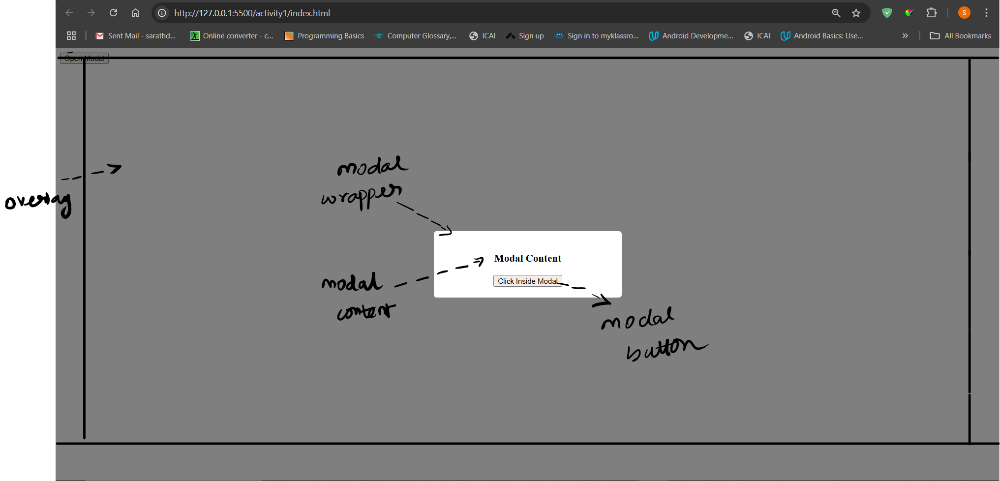
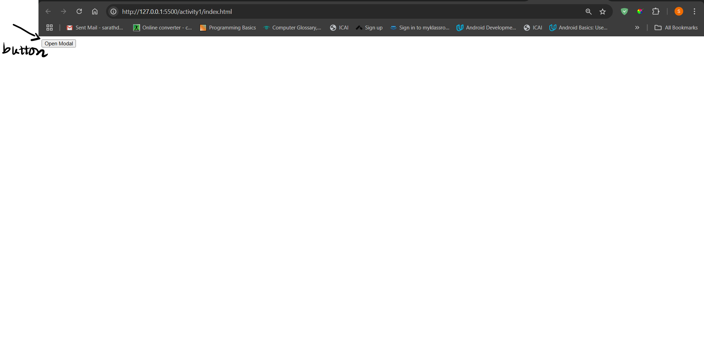

**Learning outcome:**

User understands the concept of event bubbling and how events propagate in the DOM

**Activity:**

Create a button to open a modal - open modal button, and a simple modal with overlay which is initially not displayed and create another button within the modal - button inside modal. add click event listeners for open modal button, button inside modal, overlay and modal - wrapper (div), body element and with callback functions logging which are clicked and make sure to toggle overlay display when opening the modal to show and when clicked on overlay or modal content or button inside modal. it should hide the modal. make use of style.diplay property for it.

Note: Please refer the modal-closed and modal-opened images to see how it needs to be built for
more clartiy on UI. Please open the image with chrome browser.

**Screenshots:**

Modal opened state UI:



Modal closed state UI:



Note: Please make use of event bubbling nature to close the modal when button inside modal and modal content is clicked as well.

Hint: Event bubbling should be taken care in the parent element.

Subactivity 1.1: click on open modal button and observe the sequence in which the logs are printed.

Subactivity 1.2: click on button inside modal and observe the sequence in which the logs are printed.

Subactivity 1.3: click on overlay wrapper after opening the modal and observe the sequence in which the logs are printed.

Subactivity 1.4: click on modal content and observe the sequence in which the logs are printed.

Please make sure to clear your console logs after each click, to see the proper sequence and not get confused

Note for the author who checks the solution: If it feels hard to follow even after giving UI images and exact activity description, we can provide the bare bones, basic skeleton code to work on. - this would be better in this scenario.

**Skeleton code**:

```html
<!DOCTYPE html>
<html lang="en">
  <head>
    <meta charset="UTF-8" />
    <meta name="viewport" content="width=device-width, initial-scale=1.0" />
    <title>Event Bubbling with Modal - Acitivity - 1</title>
    <style>
      .overlay {
        position: fixed;
        top: 0;
        left: 0;
        width: 100%;
        height: 100%;
        background: rgba(0, 0, 0, 0.5);
        display: flex;
        justify-content: center;
        align-items: center;
      }
      .modal {
        background: white;
        padding: 20px;
        border-radius: 5px;
        width: 300px;
        text-align: center;
      }
    </style>
  </head>
  <body id="body">
    <button id="open-modal-btn">Open Modal</button>

    <div id="modal-overlay" class="overlay" style="display: none">
      <div id="modal-content" class="modal">
        <h3>Modal Content</h3>
        <button id="btn-inside-modal">Click Inside Modal</button>
      </div>
    </div>

    <script>
      // write your solution here
    </script>
  </body>
</html>
```

Note for the author who checks the solution: We can also add solutions to the subactivities

Solution: [link](index.html)

Add on section based on given feedback:

activity1.md: Add what will learners realise/learn by doing each of the sub activities

By doing each of the subactivities mentioned above, the learners will realize the flow in which the event callbacks are called, i.e - it will flow from the element that interacted with all the way to parent root element. child -> parent element.

This will help in understanding the default behavior of how the events are bubbled up from the element they interacted with, all the way to the parent element.

Eg: 

Subactivity 1.2: click on button inside modal and observe the sequence in which the logs are printed.

logs for the above activity:

Button inside modal clicked

Modal content clicked

Overlay clicked

Body clicked