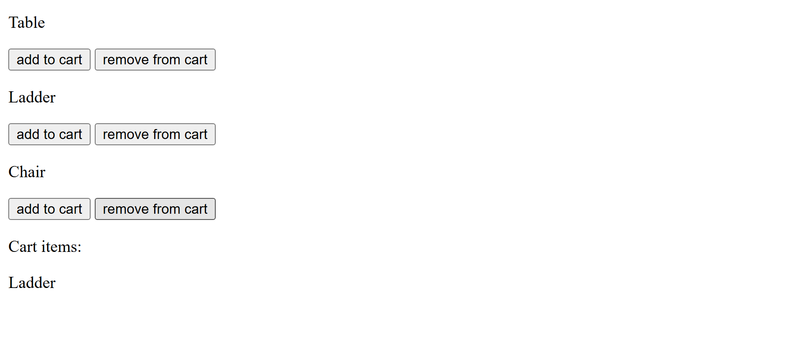

**Learning outcome:**

User should be able to identify problems where event bubbling can be utilised for better solutions
User should be able to implement event delegation by leveraging event bubbling

Note for the author who checks the solution: These above two learning outcomes could be combined together - it would be better as we leverage the event bubbling process to implement event delegation

**Activity:**

Create a list of products - product section where each product will have add, remove button.
such that when these buttons are clicked, product should be added in cart and removed from cart appropriately from list of carts - cart section. Try to do both the functionality by adding only a single event listener. Remember how the event bubbling process happens all the way up to root element starting from child element based on previous learnings.You should try to manage both add to cart / remove from cart essentailly from the parent product container.Try doing add to cart functionality first and extend it to removing the item from cart.

Note: Please refer the cart-add-remove-product image to see how it needs to be built for
more clartiy on UI. Please open the image with chrome browser.

**Screenshots:**

Cart add / remove:



Note for the author who checks the solution: If it feels hard to follow even after giving UI images and exact activity description, we can provide the bare bones, basic skeleton code to work on. it would be more better to follow through.

**Skeleton code**:

```html
<!DOCTYPE html>
<html lang="en">
  <head>
    <meta charset="UTF-8" />
    <meta name="viewport" content="width=device-width, initial-scale=1.0" />
    <title>
      Event bubbling and delegation with product and cart items - Activity - 34
    </title>
  </head>
  <body>
    <section id="product-container">
      <div class="product-item">
        <p class="product">Table</p>
        <button class="add-cart-btn">add to cart</button>
        <button class="remove-cart-btn">remove from cart</button>
      </div>
      <div class="product-item">
        <p class="product">Ladder</p>
        <button class="add-cart-btn">add to cart</button>
        <button class="remove-cart-btn">remove from cart</button>
      </div>
      <div class="product-item">
        <p class="product">Chair</p>
        <button class="add-cart-btn">add to cart</button>
        <button class="remove-cart-btn">remove from cart</button>
      </div>
    </section>

    <section id="cart-container">
      <p>Cart items:</p>
    </section>

    <script>
      // write your solution here
    </script>
  </body>
</html>
```

Hint: Think how you can distinguish between add to cart, remove from cart button element - id, className, custom data attributes etc. log the event object and check out properites that you can make use of in your code. Handling cases where trying to add product on already added item and removing already removed item / or non-existing item from cart is not necessary. You can try doing it as bonus task

Additional links for the activity:

classList: https://developer.mozilla.org/en-US/docs/Web/API/Element/classList

closest: https://developer.mozilla.org/en-US/docs/Web/API/Element/closest

custom data attributes: https://developer.mozilla.org/en-US/docs/Learn_web_development/Howto/Solve_HTML_problems/Use_data_attributes

Note for the author who checks the solution: We can explain how we leverage event bubbling by attaching a single event listener on parent which helped without having multiple listeners thereby memory efficient and how we delegated the different clicks - add to cart, remove from cart

Solution: [link](index.html)

Add on section based on given feedback:

How is the "User should be able to identify problems where event bubbling can be utilised for better solutions" outcome handled? Given more scenarios, will they be confidently able to decide if event bubbling needs to be used in each of those scenarios or not? - for this we can add some practical use cases with how to determine if event bubbling can be applied or not

For the above point i have created practical-use-case and steps to use to figure out, if we can use event bubbling or not - [link](./practical-use-case.md)

Re-design the current activity to add it as a series of smaller activities for learners to do step by step so that they don't Feel overwhelmed seeing a larger activity
Get stuck somewhere and end up not being able to try out the rest of the activity without looking at the full solution

For the above point, we can give the skeleton code along with some javascript, except the event
delegation part with helpful comments, through this it will be easier to follow and implement:

As the main part here is to make them learn event delegation. the problem doesnt fit for setting up with smaller activities generally here.

```javascript
<!DOCTYPE html>
<html lang="en">
  <head>
    <meta charset="UTF-8" />
    <meta name="viewport" content="width=device-width, initial-scale=1.0" />
    <title>Event bubbling and delegation with product and cart items - Activity - 34</title>
  </head>
  <body>
    <section id="product-container">
      <div class="product-item">
        <p class="product">Table</p>
        <button class="add-cart-btn">add to cart</button>
        <button class="remove-cart-btn">remove from cart</button>
      </div>
      <div class="product-item">
        <p class="product">Ladder</p>
        <button class="add-cart-btn">add to cart</button>
        <button class="remove-cart-btn">remove from cart</button>
      </div>
      <div class="product-item">
        <p class="product">Chair</p>
        <button class="add-cart-btn">add to cart</button>
        <button class="remove-cart-btn">remove from cart</button>
      </div>
    </section>

    <section id="cart-container">
      <p>Cart items:</p>
    </section>

    <script>
      const productContainer = document.getElementById("product-container");
      const cartContainer = document.getElementById("cart-container");

      // Here, we need to use event delegation to manage clicks on product-container
      productContainer.addEventListener("click", (event) => {

      // Get the clicked target element

      // Find the closest ancestor with the class "product-item"

      // Check if the clicked element is within a valid product item - if the productItem exists

      // Retrieve the product name from the product item - use querySelector on productItem

      // Check if the clicked element is an "Add to Cart" button - for this, you can make use of contains
      // method of classList

      // Call the function to add the product to the cart - make use of addToCart() function

      // Else Check if the clicked element is a "Remove from Cart" button - for this, you can make use of contains
      // method of classList

      // Call the function to remove the product from the cart -  make use of removeFromCart() function

      });

      function addToCart(productName) {
        const existingItem = cartContainer.querySelector(
          `[data-product="${productName}"]`
        );

        if (!existingItem) {
          const cartItem = document.createElement("p");
          cartItem.textContent = productName;
          cartItem.setAttribute("data-product", productName);
          cartContainer.appendChild(cartItem);
        } else {
          alert(`${productName} is already in the cart!`);
        }
      }

      function removeFromCart(productName) {
        const existingItem = cartContainer.querySelector(
          `[data-product="${productName}"]`
        );

        if (existingItem) {
          cartContainer.removeChild(existingItem);
        } else {
          alert(`${productName} is not in the cart!`);
        }
      }
    </script>
  </body>
</html>

```
